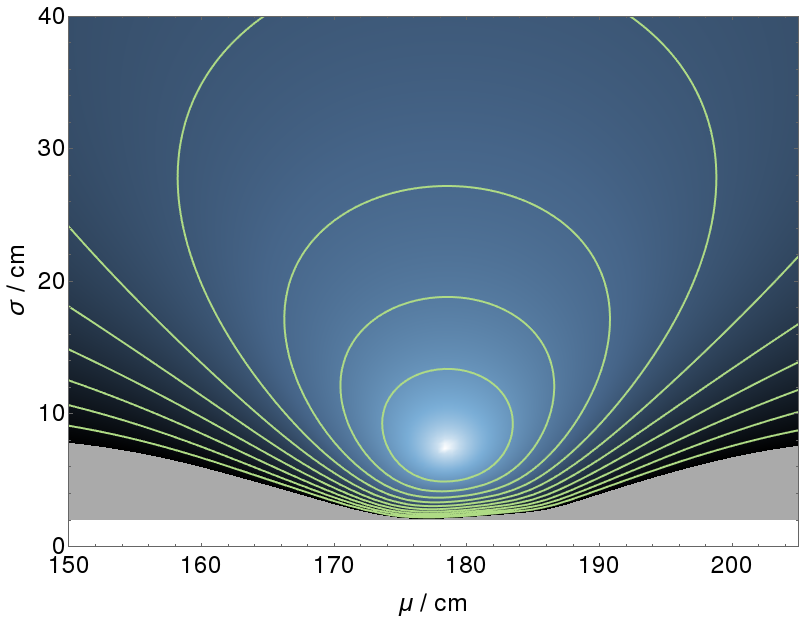

# Exploring parameter space

<br><br>

**Question 1.**

In this exercise, we shall see how it is often convenient to use vectors in machine learning. These could be in the form of data itself, or model parameters, and so on.

The purpose of this exercise is to set the scene for Linear Algebra and the rest of the maths we will cover in the specialization. If this is confusing right now - stick with us! We'll build up your skills throughout the rest of the course. For this reason we've set a low pass mark for this quiz, but even if you don't pass in one go, reading the feedback from a wrong answer can often give more insight than guessing a correct answer!

∗∗∗

The problem we shall focus on in this exercise is the distribution of heights in a population.

If we do a survey of the heights of people in a population, we may get a distribution like this:


This histogram indicates how likely it is for anyone in the survey to be in a particular height range. (6 ft is around 183 cm)

This histogram can also be represented by a vector, i.e. a list of numbers. In this case, we record the frequency of people with heights in little groups at 2.5 cm intervals, i.e. between 150 cm and 152.5 cm, between 152.5 cm and 155 cm, and so on. We can define this as the vector \mathbf{f}f with components,


These vector components are then the sizes of each bar in the histogram.

Of the following statements, select all that you think are true.


- [ ] No one in the world is less than 160 cm tall.


- [ ] If another sample was taken under the same conditions, the frequencies would be exactly the same.


- [x] There are at least 10 elements in the frequency vector, **f**.


- [ ] None of the other statements.


- [x] If another sample was taken under the same conditions, the frequencies should be broadly similar.


<br><br>

**Question 2.** One of the tasks of machine learning is to fit a model to data in order to represent the underlying distribution.

For the heights of a population, a model we may use to predict frequencies is the Normal (or Gaussian) distribution. This is a model for a bell-shaped curve, which looks like this,


<br><br>

**Question 3.**


<br><br>

**Question 4.**
A model allows us to predict the data in a distribution. In our example we can start with a parameter vector \mathbf{p}p and convert it to a vector of expected frequencies **g_p**, for example,


A model is only considered good if it fits the measured data well. Some specific values for the parameters will be better than others for a model. We need a way fit a model's parameters to data and quantify how good that fit is.

One way of doing so is to calculate the "residuals", which is the difference between the measured data and the modelled prediction for each histogram bin.

This is illustrated below. The model is shown in pink, the measured data is shown in orange and where they overlap is shown in green. The height of the pink and orange bars are the residuals.


A better fit would have as much overlap as it can, reducing the residuals as much as possible.

How could the model be improved to give the best fit to the data?


- [x] Keep the standard deviation, \sigmaσ, approximately the same.
```
Correct
The model has a width similar to the data.
```

- [ ] Decrease the standard deviation, \sigmaσ.


- [ ] Decrease the mean, \muμ.


- [x] Increase the mean, \muμ.
```
Correct
The mean of the model is too low.
```

- [ ] Keep the mean, \muμ, approximately the same.


- [ ] Increase the standard deviation, \sigmaσ.


<br><br>

**Question 5.**
The performance of a model can be quantified in a single number. One measure we can use is the Sum of Squared Residuals, \mathrm{SSR}SSR. Here we take all of the residuals (the difference between the measured and predicted data), square them and add them together.


<br><br>

**Question 6.**

Since each parameter vector **p** represents a different bell curve, each with its own value for the sum of squared residuals, **SSR**, we can draw the surface of **SSR** values over the space spanned by **p**, such as \muμ and \sigmaσ in this example.

Here is an illustration of this surface for our data.


Every point on this surface represents the SSR of a choice of parameters, with some bell curves performing better at representing the data than others.

We can take a ‘top-down’ view of the surface, and view it as a contour map, where each of the contours (in green here) represent a constant value for the **SSR**.



The goal in machine learning is to find the parameter set where the model fits the data as well as it possibly can. This translates into finding the lowest point, the global minimum, in this space.

Select all true statements below.


- [ ] You get the same model by following along a contour line.


- [x] Each point on the surface represents a set of parameters \mathbf{p}=
[μσ]
p=[ 
μ
σ
].

```
Correct
This means each point in the space will generate a different histogram of expected data, which will perform better or worse against the measured data.
```

- [ ] None of the other statements.


- [ ] At the minimum of the surface, the model exactly matches the measured data.


- [x] Moving at right angles to contour lines in the parameter space will have the greatest effect on the fit than moving in other directions.
```
Correct
For example, moving along contour lines has no affect on the \mathrm{SSR}SSR (by definition). However moving perpendicular to them can significantly improve or reduce the quality of the fit.
```


<br><br>

**Question 7.**


<br><br>


