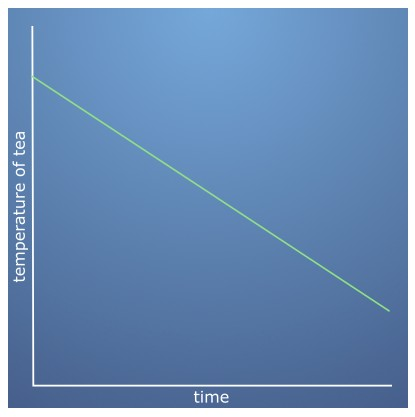

# Matching functions visually
---
<br><br>
**Question 1.**
n this quiz you will get a refresher in functions - in particular, matching a description of a function to the graph of the function.

Imagine that you place one end of a water hose into a swimming pool and turn the tap on at the other end. Water then pours into the pool at a constant rate, causing the volume of water in the pool to increase at a constant rate.

While the swimming pool is still filling up with water, what would we expect the plot of the function of volume of water in the pool with respect to time to look like?

- [ ] 

- [ ] 

- [x] 

- [ ] 

```
Correct
Well done! As water flows in at a constant rate, the volume increases at a
constant rate, so the graph is just a straight line.
```
<br><br>
**Question 2.**
Jessica makes a cup of tea but gets distracted writing her code, and forgets to drink it.

The tea is left to cool down. The speed of cooling depends on the temperature of the tea: when it is hot it cools down quickly and as it gets colder it cools down more and more slowly, until it approaches room temperature.

Which of the following graphs could represent the temperature of that cup of tea with time?

- [ ] 

- [ ] 

- [ ] 

- [x] 

```
Correct
If you're interested in understanding more you could read about Newton's law
of cooling. This is an exponential function; you'll see more of this type of
function soon.
```
<br><br>
**Question 3.**
Rahul drops a ball from the top of a ladder into a pit of sand.

When the ball is released it begins to accelerate towards the ground, getting faster and faster until it hits the sand and quickly becomes stationary again. What would a plot of the speed of the ball against time look like?

- [ ] 

- [ ] 

- [ ] 

- [x] 

```
Correct
The plot has three distinct regions. When the ball is falling it speeds up at
at a constant rate of acceleration, then it suddenly decelerates and has zero
speed in the sandpit.
```
<br><br>
**Question 4.**
Bags of flour labelled 1 kg from a supermarket are weighed. Most of the weights measured are very close to 1 kg, with some a little more and others a little less. Those which are further away from 1 kg are found less and less often, with almost no bags more than 100 g out.

What might we expect the plot of frequency (i.e. how often a type of bag is found) against mass to look like?

- [ ] 

- [x] 

- [ ] 

- [ ] 

```
Correct
The weights can be approximated by a bell-curve, called the "Normal Distribution".
```
<br><br>
**Question 5.**
Question 5
A mass is attached to a string and hung from the ceiling. It is then pulled away from its natural hanging position (called equilibrium) and released, so that it swings backwards and forwards. Let's assume there is no air resistance, so that when the mass swings back it returns all the way back to where it was originally released. It completes a full swing, away and back, every 2 seconds.

What is a reasonable plot for the displacement of the mass from equilibrium with respect to time?

- [ ] 

- [ ] 

- [ ] 

- [x] 

```
Correct
This is called a simple harmonic oscillator - that is, we model the movement
of the pendulum through time as a simple sine wave, with some amplitude
(determined by the maximum distance of the pendulum to the equilibrium point)
and some frequency (determined by the period of the swing).

The pendulum takes 2 seconds to complete a full revolution, which can also be
described as swinging at a frequency of 0.5 Hz.
```
