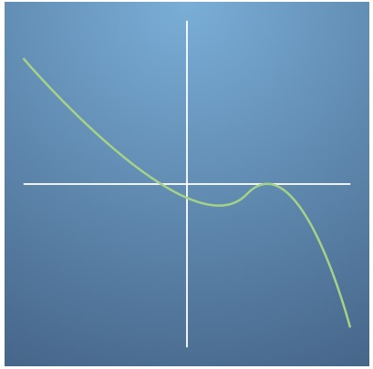

# Matching the graph of a function to the graph of its derivative
---
**Question 1.**
Question 1
In this quiz you will practice estimating the derivative of a function by choosing the most suitable graphs.

We can calculate the gradient of a straight line by looking at how much the function f(x)f(x) changes, divided by the the amount the variable xx changes. This is sometimes called "rise over run", as illustrated in the following image:
<br><br>

<br><br>
Use this information to estimate the gradient of the tangent to the non-linear, green function at the point (4, 2)(4,2) based on the image below. (NB. the tangent line at the point (4, 2)(4,2) is drawn on in orange to help you do this calculation.)
<br><br>

<br><br>


- [ ] The gradient is -1.

- [ ] The gradient is 0.

- [x] The gradient is 1.

- [ ] The gradient is 2.

```
Correct
Change in y divided by the change in x gives the gradient of a straight
line (the tangent).
```
<br><br>
**Question 2.**
It's possible to have a reasonable guess at what the derivative of a function will look like by considering regions of the function with different gradients. Let's look at the following image as an example:
<br><br>

<br><br>
We can see that there are three types of behaviour we might see in the gradient of a smooth function. On the left there is a region where the function is increasing, and therefore has a positive gradient, which is the same as saying it has a positive derivative.

On the right there is a region where the function is decreasing, so the gradient and derivative would are negative.

In between there is a turning point, where the gradient is exactly 00 at a specific value of xx. Here the derivative will pass through 00 as it moves from positive on the left to negative on the right.

Using this information, which plot could showing the derivative of the above function? Assume the xx-axis is over the same range.

- [x] 
<br><br>
<br><br>

- [ ] 
<br><br>
<br><br>

- [ ] 
<br><br>
<br><br>

- [ ] 
<br><br>
<br><br>

```
Correct
The derivative starts positive in the "increasing region" and becomes negative
in the "decreasing region", passing through zero at the "turning point"
```
**Question 3.**
Use the same method of breaking up the plot into increasing and decreasing regions and points with zero gradient to identify which diagram below best describes the derivative of the function in the following graph. (Hint: start by counting how many times the gradient is zero.)


<br><br><br><br>

- [ ] 
<br><br>
<br><br>

- [x] 
<br><br>
<br><br>

- [ ] 
<br><br>
<br><br>

- [ ] 
<br><br>
<br><br>

```
Correct
This figure best describes how the function changes with x.
```

**Question 4.**
Which diagram best describes the derivative of the function in the following diagram? (Hint: This function is just the same as the previous question, but shift upwards... will this affect the gradient?)


<br><br>

- [ ] 
<br><br>
<br><br>

- [ ] 
<br><br>
<br><br>

- [ ] 
<br><br>
<br><br>

- [x] 
<br><br>
<br><br>

```
Correct
Shifting a function up or down does not change the gradient at all.
```
**Question 5.**
Now for the reverse problem... Look at the figure below.


- [x] 
<br><br>
<br><br>


- [ ] 
<br><br>
<br><br>

- [ ] 
<br><br>
<br><br>

- [x] 
<br><br>
<br><br>

```
Correct
Well done! If one function is a vertical shift of another function, then they have the 
same differential.
```
